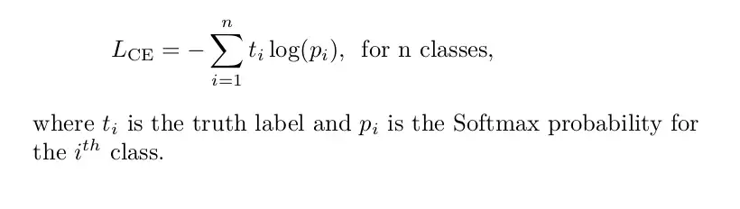
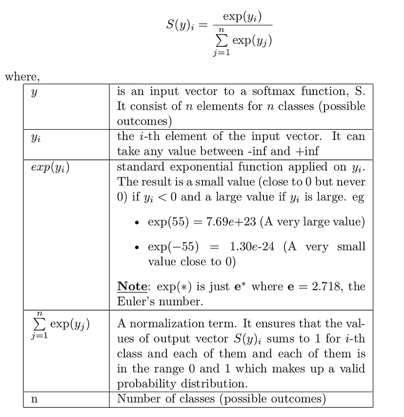

# 2023-02-10
  - [Understanding RMSprop — faster neural network learning](https://towardsdatascience.com/understanding-rmsprop-faster-neural-network-learning-62e116fcf29a)
  
  - [Neural Networks for ML - Overview of mini-batch gradient descent](https://www.cs.toronto.edu/~tijmen/csc321/slides/lecture_slides_lec6.pdf)

# 2023-02-09
  - [Cross-Entropy Loss Function](https://towardsdatascience.com/cross-entropy-loss-function-f38c4ec8643e)
    
	
  - [Softmax Activation Function - How It Actually Works](https://towardsdatascience.com/softmax-activation-function-how-it-actually-works-d292d335bd78)
    
	
  
